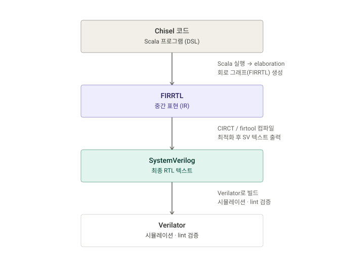

# axi4lite-buffer-gen

Chisel로 만든 파라메트릭 하드웨어 제너레이터 모음. 같은 Scala 코드에서 파라미터(폭·깊이·레지스터 개수)만 바꿔 서로 다른 SystemVerilog를 생성하고, 시뮬레이션으로 검증합니다.

`Counter` → `SimpleFSM` → `ParametricFIFO` → `AxiLiteBuffer` 순으로 점점 복잡한 회로를 구현했습니다. 그중 주요 구현은 [AXI4-Lite](https://support.arm.com/documentation/ihi0022/latest/)(ARM AMBA 계열의 경량 레지스터 접근 프로토콜) 슬레이브 레지스터 버퍼입니다.

## 컴파일 파이프라인



## 구성 요소

| 모듈 | 설명 | 소스 | 테스트 |
|---|---|---|---|
| `Counter` | 8비트 카운터 | [`Counter.scala`](src/main/scala/Counter.scala) | [`CounterSpec.scala`](src/test/scala/CounterSpec.scala) |
| `SimpleFSM` | IDLE/READ/WRITE 3상태 FSM | [`SimpleFSM.scala`](src/main/scala/SimpleFSM.scala) | [`SimpleFSMSpec.scala`](src/test/scala/SimpleFSMSpec.scala) |
| `ParametricFIFO` | `dataWidth`/`depth`를 파라미터로 받는 원형 버퍼 FIFO | [`ParametricFIFO.scala`](src/main/scala/ParametricFIFO.scala) | [`ParametricFIFOSpec.scala`](src/test/scala/ParametricFIFOSpec.scala) |
| `AxiLiteBuffer` | AXI4-Lite 슬레이브 레지스터 버퍼 (write/read FSM, WSTRB 바이트 마스킹, 범위밖 SLVERR) | [`AxiLiteBuffer.scala`](src/main/scala/AxiLiteBuffer.scala), [`AxiLiteConfig.scala`](src/main/scala/AxiLiteConfig.scala) | [`AxiLiteBufferSpec.scala`](src/test/scala/AxiLiteBufferSpec.scala) |

### AxiLiteBuffer 검증 5종

1. 쓴 값을 그대로 읽어온다 (directed write → read)
2. WSTRB로 일부 바이트만 갱신한다 (partial write)
3. AW/W가 서로 다른 사이클에 도착해도(핸드셰이크 스톨) 정확히 write한다
4. 범위 밖 주소는 SLVERR을 응답한다
5. 랜덤 트랜잭션을 참조 모델(scoreboard)과 대조한다

### 파라미터화 확인 — 2 config SV 생성

`GenAxiLiteBuffer`가 같은 설계를 두 config로 생성합니다.

| config | addrWidth | dataWidth | numRegs | 결과 |
|---|---|---|---|---|
| `axi_w32_n16` | 32 | 32 | 16 | [`generated/axi_w32_n16/AxiLiteBuffer.sv`](generated/axi_w32_n16/AxiLiteBuffer.sv) |
| `axi_w64_n64` | 32 | 64 | 64 | [`generated/axi_w64_n64/AxiLiteBuffer.sv`](generated/axi_w64_n64/AxiLiteBuffer.sv) |

두 결과물을 diff하면 WSTRB 마스킹 mux 체인 폭(4↔8바이트), 주소 인덱스 비트 슬라이스 폭, `addrSpan` 상수, 레지스터 폭·개수가 config에 따라 그대로 달라지는 걸 확인할 수 있습니다. `ParametricFIFO`도 `GenFifo`로 `(32, 16)`/`(64, 64)` 두 config를 같은 방식으로 생성합니다.

```bash
diff generated/axi_w32_n16/AxiLiteBuffer.sv generated/axi_w64_n64/AxiLiteBuffer.sv
```

## 스택

- [Chisel](https://www.chisel-lang.org/) 7.15.0 / Scala 2.13.18 / sbt 1.10.7
- SystemVerilog 방출: 내장 `circt.stage.ChiselStage`
- 시뮬레이션: Chisel 내장 `chisel3.simulator.EphemeralSimulator`
- 린트: [Verilator](https://www.veripool.org/verilator/) 5.048

## 실행

```bash
# 전체 테스트 (Counter/SimpleFSM/ParametricFIFO/AxiLiteBuffer, 총 12개)
sbt test

# SystemVerilog 생성
sbt "runMain Gen"              # Counter, SimpleFSM → generated/
sbt "runMain GenFifo"          # ParametricFIFO 2 config → generated/fifo_w32_d16, fifo_w64_d64
sbt "runMain GenAxiLiteBuffer" # AxiLiteBuffer 2 config → generated/axi_w32_n16, axi_w64_n64

# 생성된 SV 린트
verilator --lint-only generated/axi_w32_n16/AxiLiteBuffer.sv
```
